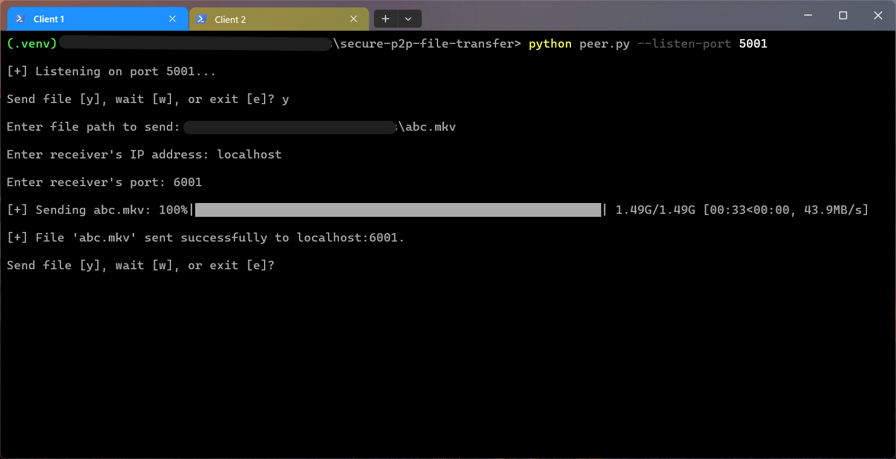
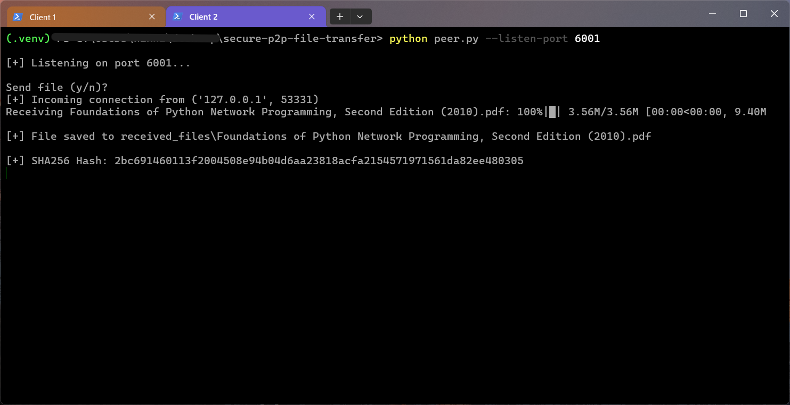

# 🔐 Secure P2P File Sharing System 

A lightweight, secure, and efficient **peer-to-peer (P2P)** file sharing system built in Python. This tool allows two peers to send and receive files directly over a network using **TCP sockets**, with **AES encryption**, **RSA key exchange**, and **zlib compression** to ensure privacy, integrity, and efficiency.

---

## 🚀 Features

- 📡 Peer-to-peer architecture (no central server)
- 🔒 AES (symmetric) encryption for fast and secure file protection
- 🔑 RSA (asymmetric) encryption for safe AES key exchange
- 🗜️ Zlib compression to reduce file size before encryption
- 📁 File name and structure preserved on receipt
- 📊 Real-time progress bar using `tqdm`
- 🔂 Multi-transfer-ready: concurrent transfers handled in separate threads
- ✅ IP and port validation using `ipaddress` module

---

## 🔐 Security

- AES: Fast file encryption (Fernet/AES-128 in CBC mode)

- RSA: 2048-bit key pair to encrypt the AES key

- Zlib Compression: Reduces file size before encryption to optimize transfer

- SHA-256: File integrity check printed after decryption

---

## 📸 Screenshots

### 📤 Send File Prompt



### 🔽 Receiving File with Progress Bar



---

## 🛠️ Project Structure


```
secure-p2p-file-transfer/
├── peer.py
| 
├── crypto/
│ ├── aes_crypto.py
│ └── rsa_crypto.py
| 
├── utils/
│ └── file_utils.py
|
├── keys/
│ ├── private_key.pem     # (Ignored) Generated RSA private key
│ └── public_keys.pem     # Shared RSA public key
|
├── received_files/
| 
├── .gitignore
└── README.md
```

---

## 📦 Requirements

- Python 3.10+
- [`cryptography`](https://pypi.org/project/cryptography/)
- [`tqdm`](https://pypi.org/project/tqdm/)

### 📥 Install dependencies

```bash
python -m venv .venv
source .venv/Scripts/activate        # Windows
# or
source .venv/bin/activate            # Linux/macOS

pip install cryptography tqdm
```

---

## 📡 Usage

### 📥 Start a peer to receive files

```bash
python peer.py --listen-port 5001
```

### 📤 Send a file to another peer
You will be prompted:

```
Send file (y/n)? y
Enter file path to send: sample.txt
Enter receiver's IP address: 192.168.1.10
Enter receiver's port: 5001
```

- The file will be compressed, encrypted, transferred securely, and the sender and recipient will see a progress bar and confirmation.

---
